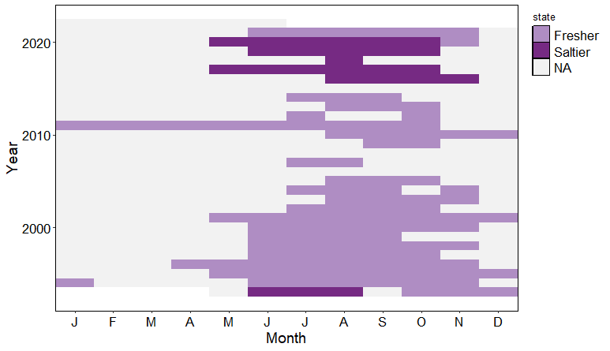
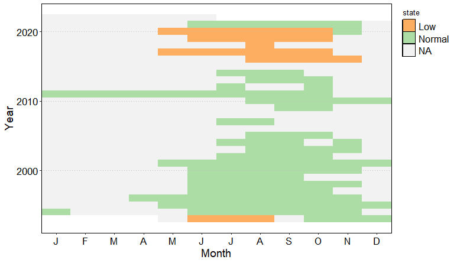

```{r, include = FALSE}
knitr::opts_chunk$set(
  collapse = TRUE,
  comment = "#>"
)
```

## Overview
This is a vignette to demonstrate how to identify state shifts in the residuals of a model. The model used in this example is the \href{https://github.com/ThomasWestfall/CQ2}{quick-slow Hubbard Brook C-Q model}, and essentially, the C-Q model simulates daily water quality concentrations. The purpose of this vignette is to take the residuals (error) from the C-Q model, and identify where the C-Q model over-predicts and under-predicts actual water quality observations. This informs when the actual water quality concentration is lower or higher than what could be explained by the C-Q model. Effectively, this is the change in observed concentration per a given unit of streamflow, and this has been utilized to identify how hydrological processes are changing during prolonged multi-year droughts. Details of the methodology and application are within a manuscript under review:


Westfall, T. G., Peterson, T. J., Lintern, A. & Western, A. W. (in review), ‘Fresher streams after a prolonged drought in Victoria, Australia', Water Resources Research


Below is an example of when observed stream salinity (EC) concentration is fresher and saltier than what the C-Q model estimated. At times, the C-Q model over-predicts suggesting observed stream salinity is "fresher" than expected, and at other times, under-predicts suggesting observed stream salinity is "saltier" than expected. 

{width=100%}

### Add a few additional R-packages
```{r setup}
library(tidyr)
# library(dplyr)
library(ggplot2)
```


## Load required data
This example imports a dataframe from the output of the C-Q model with actual concentration "obs.C" and simulated concentration "sim.C" from the model in units of milligrams per liter (mg/L). Note the "residuals" are also imported and are in natural log space (log("sim.C") - log("obs.C")). Besides the residuals, the only other required columns are a time-step (either: "year", "month", or "day"). Only "year" is required for an annual analysis, "year" and "month" for a monthly analysis, and "year", "month", and "day" for a daily analysis. This example shows a daily and monthly analysis. For reference, the dataframe imported for this example also include catchment average runoff as "flow" (which is streamflow divided by catchment area) and baseflow as "flow.s" (from CQ2 model output), both in units of millimeters per day (mm/d). 

```r
# Select gaugeID
gaugeID = "234201B"

# Load
Residual.daily = hydroState::Residual.daily_234201B

# Check input data
head(Residuals.daily)

#>  year month day   residual        flow    sim.C    obs.C      flow.s    dtime  yearmonth
#> 1993     5  14 -0.2787168 0.007035374 2998.147 3961.851 0.007035374 1993.364 1993-05-01
#> 1993     5  15 -0.2976464 0.007100299 3045.682 4101.576 0.006778027 1993.367 1993-05-01
#> 1993     5  16 -0.3351499 0.007723581 3088.122 4317.657 0.006542165 1993.370 1993-05-01
#> 1993     5  17 -0.3012015 0.007870385 3131.548 4232.229 0.006320192 1993.373 1993-05-01
#> 1993     5  18 -0.3129623 0.007946491 3174.245 4340.684 0.006110441 1993.375 1993-05-01
#> 1993     5  19 -0.3955748 0.008211242 3214.283 4773.975 0.005914876 1993.378 1993-05-01
```

## Calculate residuals (if needed)
```r
# Residuals in natural log space
Residual.daily$residuals = log(Residual.daily$sim.C) - log(Residual.daily$obs.C)
```

## Create monthly dataframe (if needed)
```r
# Create year-month column
Residual.monthly =  Residual.daily  %>%
    mutate(yearmonth = lubridate::make_date(year,month))

# Aggregate daily data into monthly data by taking the mean of the residual and sum of flow
Residual.monthly = Residual.monthly %>% group_by(yearmonth = yearmonth) %>%
    summarize(
              year = mean(year),
              month = mean(month),
              residual.count = sum(!is.na(residual)),
              residual = mean(residual, na.rm = TRUE),
              flow = sum(flow, na.rm = TRUE),
              flow.s = sum(flow.s, na.rm = TRUE)
              )
   
# just make dataframe rather than tbl..            
Residual.monthly = as.data.frame(Residual.monthly) 
              
# If number of days with residuals in a month is less than 28, remove by setting month residual to NA.
Residual.monthly$residual[which(Residual.monthly$residual.count <28)] = NA

```

# Monthly residual state analysis 
This builds a one and two state monthly model to evaluate the residuals of the quick-slow C-Q model. Set the dependent variable 'dep.variable' to equal the residual time series. The monthly model is simply a function the conditional mean, 'a0', and standard deviation, 'std.a0'.
```r

## Build model with one-stata
model.monthly.1 = build(input.data = data.frame(
                        year = Residual.monthly$year,
                        month = Residual.monthly$month,
                        dep.variable = Residual.monthly$residual),
                data.transform = 'none',
                parameters = c('a0','std.a0'),
                state.shift.parameters = c('a0','std.a0'),
                error.distribution = 'truc.normal',
                flickering = FALSE,
                transition.graph = matrix(TRUE,1,1))
                
# Build model with two-states
model.monthly.2 = build(input.data = data.frame(
                        year = Residual.monthly$year,
                        month = Residual.monthly$month,
                        dep.variable = Residual.monthly$residual),
                data.transform = 'none',
                parameters = c('a0','std.a0'),
                state.shift.parameters = c('a0','std.a0'),
                error.distribution = 'truc.normal',
                flickering = FALSE,
                transition.graph = matrix(TRUE,2,2))
```

## Fit both monthly models
```r
model.monthly.1 = fit.hydroState(model.monthly.1, pop.size.perParameter = 10, max.generations = 500)

model.monthly.2 = fit.hydroState(model.monthly.2, pop.size.perParameter = 10, max.generations = 500)

```
## Compare 1-state and 2-state models

## Is the 2-state model acceptable?
If the 2-state model has a better likelihood than the 1-state model, than we can accept the 2-state model. Since we are optimizing through minimizing the negative log-likelihood function, the model with the lower negative log-likelihood is the accepted model. Thus, the 2-state model can only be accepted when the negative log-likelihood is lower than the 1-state model. 
```r
model.monthly.1@calibration.results$bestval
#> [1] -50.3986

model.monthly.2@calibration.results$bestval
#> [1] -59.5713

```
(i.e., -59.5713 < -50.3986, so we can accept the 2-state model is best at explaining the reality of the system)

## Is there sufficient evidence for the 2-state model?
Now that the 2-state model is accepted, compare the Akaike Information Criteria (AIC) of each model in order to determine if there is enough weight of evidence to support the 2-state model. The AIC of the 2-state model should be less than the 1-state model. 
```r
get.AIC(model.monthly.1)
#> [1] -96.79721

get.AIC(model.monthly.2)
#> [1] -105.1427
```
(i.e., -105.1427 < -96.79721, so there is sufficient evidence for the 2-state model)

## Tile plot of states over time
For the 2-state model, the most probable sequence of states is determined using the Viterbi algorithm. Then, we assign a name to each state based on the value of their conditional mean. The 'normal' state is assigned to the state that occurs most often throughout the record. This 'normal' is relative, where the other state will either be 'low' or 'high' depending on the conditional mean of each state. 
```r
# set the reference year to name the states
model.monthly.2 = setInitialYear(model.monthly.2, 1993)

# plot grid plot.. 
plot(model.monthly.2, state.grid = TRUE)

```
This produces a grid plot with the states shown over time. Given this is for a residual time series analysis, the states indicated where the C-Q model overestimated and underestimated observations. The 'low' state indicates where residuals are lower (more negative) than what the C-Q model estimated, so an under estimation. The 'normal' state indicates where residuals are 'higher' than what the C-Q model estimated, so an over estimation. This grid plot can be re-plotted to reflect a more informative meaning of these residual states.

{width=100%}


## Tile plot of saltier and fresher states over time
Since the C-Q model explained stream salinity (EC) concentration as a function of streamflow, the residuals represent where stream salinity (EC) concentration is lower or higher, independent of streamflow. The state names can then be conveniently renamed to "fresher" to indicate when the stream is "fresher" (less salty) than expected and "saltier" (more salty) than expected for a given streamflow.

```r
# export states
model.states = get.states(model.monthly.2)

## rename state names, colors, then match for plotting
model.states[which(model.states['State Name'] == "Normal"),'State Name'] = "Fresher"
model.states[which(model.states['State Name'] == "Low"),'State Name'] = "Saltier"

#colours
state.colours = c("#af8dc3","#762a83")

# match 
state.match <- setNames(
                  state.colours,
                  c("Fresher","Saltier")
                )

# add additional date columns for plotting
model.states$date = as.Date(ISOdate(model.states$Year, model.states$Month,1))
model.states$pairdate =  format(model.states$date, format="%m")
model.states$Year = as.numeric(model.states$Year)

# plot grid plot with renamed states
ggplot(model.states, aes(x = pairdate, y = Year, fill = `State Name`)) +
              geom_tile() +
              scale_fill_manual(values = state.match, na.value = "grey95") +
              scale_x_discrete(expand = c(0,0),
                               breaks =c("01","02","03","04","05","06","07","08","09","10","11","12"),
                               labels = c("J","F","M","A","M","J","J","A","S","O","N","D")) +
              scale_y_continuous(breaks = seq(min(model.states$Year[model.states$Year %% 10 == 0]), max(model.states$Year), by = 10),) +
              labs(x = "Month", y = "Year", fill = "state") +
              theme(panel.grid = element_blank(),
                    panel.background = element_rect(fill = "white"),
                    panel.border = element_rect(fill = "transparent", color = "black"),
                    axis.text = element_text(size = 14, color = "black"),
                    axis.title = element_text(size = 16, color = "black"),
                    legend.text = element_text(size = 14, color = "black"),
                    legend.position = "right",
                    legend.justification = "top",
                    legend.key = element_rect(colour = "black", linewidth = 1))

```

{width=100%}


